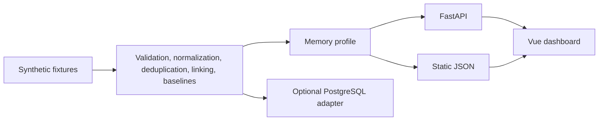

# Finnews Intelligence Platform

Local-first financial-news intelligence platform for portfolio demonstration. Milestone 0 is an offline synthetic-data vertical slice: it ingests fictional Chinese and English financial-news metadata, normalizes and deduplicates it, links fictional companies, classifies events and sentiment with transparent baselines, generates daily digests and company signals, exposes a FastAPI read API, and renders a Vue 3 dashboard.

This project is not investment advice and does not provide live market intelligence.

## Architecture



## Implemented In Milestone 0

- Modular monolith backend with domain, application, infrastructure, and interfaces layers.
- Synthetic local JSONL and RSS fixture ingestion.
- Unicode/text/URL/time normalization and malformed-record quarantine.
- Exact duplicate detection and bounded TF-IDF near-duplicate checks.
- Deterministic company/ticker linking, event classification, and sentiment scoring.
- Memory repository for default offline runs.
- PostgreSQL schema, SQLAlchemy models, and Alembic migration for optional integration.
- FastAPI read API and Typer CLI.
- Vue 3 TypeScript dashboard with static-demo and API data modes.
- Local verification script, docs, and future GitHub Actions/Page workflow files.

## Verified Synthetic Dataset

- 68 raw observations loaded in the memory demo.
- 60 valid JSONL observations, 4 malformed JSONL validation records, and 4 RSS fixture records.
- 12 clearly fictional companies across multiple fictional sectors.
- 5 loaded synthetic sources.
- Deduplication accounting: 4 rejected observations, 64 valid observations, 46 canonical articles, 8 exact duplicate observations, 10 near-duplicate observations, 18 duplicate observations, 8 exact duplicate pairs, 10 near-duplicate pairs, and 18 duplicate clusters.
- Pipeline demo output: 46 canonical articles, 7 digests, and 46 daily company signals.
- All 9 event categories and all 4 sentiment labels are represented.
- `finnews evaluate-demo` currently reports `synthetic_demo_matches=54 synthetic_demo_total=54`, `synthetic_disposition_matches=68 synthetic_disposition_total=68`, and the same deduplication metrics.

## Quick Start

```text
python -m venv .venv
.venv\Scripts\python -m pip install -e backend[dev]
cd frontend
npm install
cd ..
python scripts/dev.py export-static
python scripts/dev.py verify-lite
```

Run the memory demo directly:

```text
cd backend
python -m finnews.interfaces.cli.app demo --profile memory
```

## Optional PostgreSQL Verification

```text
python scripts/dev.py db-up
python scripts/dev.py verify-postgres
python scripts/dev.py db-down
```

The database is bound to `127.0.0.1:55432`, uses a local demo password, and is not suitable for production.

PostgreSQL integration was verified locally with the official `postgres:16` image,
Compose project `finnews_m0_verify`, service `postgres`, and port
`127.0.0.1:55432`. The verification runs Alembic upgrade/downgrade/re-upgrade,
repository parity, full fixture-pipeline persistence, API and CLI PostgreSQL
profile checks, then removes the task-owned container, volume, and network.

## Verification Evidence

The latest lightweight verification passed:

- Backend tests: tracked by `python scripts/dev.py verify-lite`.
- PostgreSQL integration tests: 5 passed with `python scripts/dev.py verify-postgres`.
- Backend coverage: enforced at the 80% threshold.
- Frontend tests: 8 passed.
- Ruff, Ruff format, mypy, ESLint, Prettier, TypeScript, Vite build, memory demo, static export, and `git diff --check` passed.

## API Examples

```text
GET /health/live
GET /api/v1/articles?ticker=ALP&limit=20
GET /api/v1/digests/2026-06-20
GET /api/v1/signals/daily
```

## Frontend

The Vue app can read generated JSON from `frontend/public/demo-data` for static hosting, or call FastAPI when `VITE_FINNEWS_DATA_MODE=api`.

## Data And Copyright Policy

Committed records are fully synthetic and fictional. The project stores metadata, source-provided snippets, URLs, provenance, hashes, and derived features only. It does not republish copied article bodies, bypass access controls, or require paid news/model APIs.

## Roadmap

Milestones 1-4 are documented in `docs/ROADMAP.md` and are not implemented yet.

## Limitations

- No live source adapters in Milestone 0.
- Baselines are deterministic rules, not predictive models.
- PostgreSQL repository behavior is verified locally, but this is still synthetic research tooling rather than production financial advice.
- GitHub Actions files are present for future manual push; no CI result is claimed locally.
