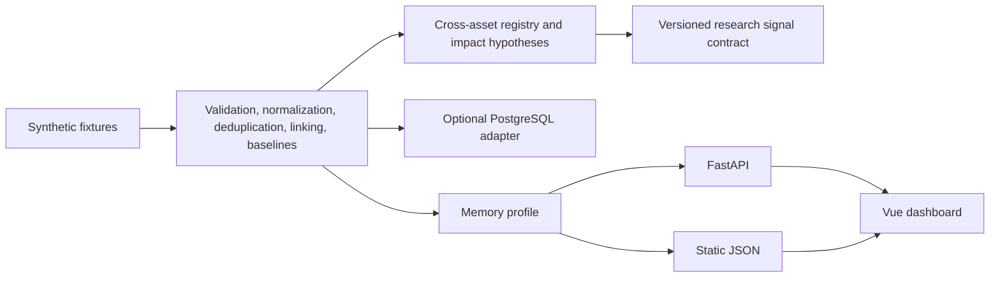

# FinNews Intelligence Platform

Local-first cross-asset financial information and event-intelligence platform. FinNews now centers on canonical asset identity, event-to-asset impact hypotheses, research signal candidates, and safe local handoff contracts across U.S. equities, ETFs, indices, FX, precious metals, commodities, futures, crypto assets, macro indicators, rates, and regulation.

This project is synthetic research tooling. It is not investment advice, does not provide live market intelligence, and does not execute trades.

## Architecture



## Implemented In Milestone 0

- Modular monolith backend with domain, application, infrastructure, and interfaces layers.
- Synthetic local JSONL and RSS fixture ingestion.
- Unicode/text/URL/time normalization and malformed-record quarantine.
- Exact duplicate detection and bounded TF-IDF near-duplicate checks.
- Deterministic company/ticker linking, event classification, and sentiment scoring.
- Memory repository for default offline runs.
- PostgreSQL schema, SQLAlchemy models, and Alembic migration for optional integration.
- FastAPI read API and Typer CLI.
- Vue 3 TypeScript dashboard with static-demo and API data modes.
- Local verification script, docs, and future GitHub Actions/Page workflow files.

## Implemented In Milestone 1A

- Repository-owned YAML source registry with typed validation and approval gates.
- Disabled-by-default example RSS, documented JSON API, and user JSON/CSV export definitions.
- Bounded HTTP client with HTTPS, allowlist, redirect, response-size, content-type, and private-address controls.
- ETag and Last-Modified fetch state plus `304 Not Modified` handling.
- Bounded retry, run-once source fetches, source health, and fetch attempts.
- RSS/Atom, documented JSON announcement, and user JSON/CSV announcement adapters.
- Memory and PostgreSQL source-state persistence.
- Read-only source API endpoints, `finnews source ...` CLI commands, Vue Source Health page, and static-demo source-health data.

## Implemented In Milestone 1B

- Repository-owned source-review evidence with config/review integrity checks.
- Disabled-by-default official pilot definitions for Federal Reserve RSS and SEC EDGAR Submissions.
- Local-only source overrides for one-off reviewed source enablement.
- SEC columnar JSON metadata parsing for synthetic/offline tests.
- Guarded `finnews source smoke-test` command with no-persist default and explicit live gates.
- Read-only source-review API metadata and Vue Source Catalog visibility.
- Static demo review examples remain synthetic; no live response or real item text is committed.

## Implemented In Milestone 2A

- Versioned `synthetic-finnews-nlp-v1` bilingual benchmark with 1,296 original synthetic records.
- Leakage-safe train/validation/test split by template family and story group.
- Dummy, rule-based, and bounded scikit-learn baselines for event and sentiment tasks.
- Validation-only candidate selection, probability calibration, confidence/coverage, and abstention analysis.
- Deterministic test reports, error analysis, model cards, dataset card, and safe model-registry metadata.
- Read-only NLP API endpoints, `finnews nlp ...` CLI commands, Vue NLP Evaluation page, and static-demo JSON.

Milestone 2A metrics describe only the synthetic benchmark. They are not human-labeled, market representative, production validation, or investment advice.

## Implemented In Milestone 3A

- Versioned `finnews-research-export-v1` contract at semantic version `1.0.0`.
- Deterministic synthetic A-share-style calendar with 60 sessions and no official-calendar claim.
- Point-in-time information availability, explicit decision cutoffs, session assignment, and leakage audit.
- Dense rolling news-factor panel over 12 fictional companies and windows `1,3,5,10`, producing exactly 2,880 demo feature rows.
- Safe lineage, quality report, deterministic CSV/JSONL package writer, read-only API, CLI, Vue Research Export page, static-demo JSON, and PostgreSQL metadata tables.

Milestone 3A exports contain no article text, market prices, returns, backtests, strategy signals, or investment recommendations.

## Implemented In Revised Milestone 3A

- Repositioned the product around cross-asset information intelligence instead of an A-share-first downstream export.
- Added a canonical 40-asset synthetic registry with aliases, provider symbols, local broker-symbol mapping schema, and cross-asset relationships.
- Added 100 synthetic cross-asset events, 240 event-to-asset impact hypotheses, and 80 point-in-time research signal candidates.
- Added versioned `finnews-market-signal-v1` package contract with deterministic hashes and no execution fields.
- Added read-only API endpoints, Typer CLI commands, Vue pages, static-demo JSON, PostgreSQL tables, and Alembic migration for the cross-asset foundation.
- Added offline MT5 readiness checks and documentation. There is no MT5 package import, terminal connection, credential handling, account access, or execution path.

The prior A-share research export remains available as an optional integration under `/optional-integrations/research-export`.

## Implemented In Milestone 3B

- Added reviewed official-source metadata for macro, energy, derivatives, regulatory, issuer, central-bank, and crypto-status research sources.
- Added synthetic official-data fixtures with point-in-time observation revisions, release events, regulatory metadata, and asset associations.
- Added official-data API/CLI/static-demo surfaces, Vue Official Data Monitor, PostgreSQL metadata, source audits, and release audit documentation.

Milestone 3B still uses synthetic demo data by default. Real sources remain disabled unless reviewed and explicitly enabled through local configuration.

## Implemented In Milestone 3C

- Added versioned `finnews-market-bars-v1` local CSV/JSONL import contract with strict UTC, OHLC, volume, duplicate, monotonic, and forbidden-field validation.
- Added three deterministic synthetic market-reaction scenarios with 24 assets, 90 sessions each, and 6,480 total synthetic bars generated locally.
- Added event-study windows, abnormal returns, reaction labels, signal-quality metrics, deterministic error analysis, and leakage diagnostics.
- Added read-only market-reaction API endpoints, Typer CLI commands, Vue Market Reaction Lab, static-demo JSON samples, and PostgreSQL metadata tables.

Milestone 3C does not fetch live prices, store local user import paths in tracked output, connect to MT5, accept credentials, access accounts, create positions, or provide investment recommendations.

## Verified Synthetic Dataset

- 68 raw observations loaded in the memory demo.
- 60 valid JSONL observations, 4 malformed JSONL validation records, and 4 RSS fixture records.
- 12 clearly fictional companies across multiple fictional sectors.
- 5 loaded synthetic sources.
- Deduplication accounting: 4 rejected observations, 64 valid observations, 46 canonical articles, 8 exact duplicate observations, 10 near-duplicate observations, 18 duplicate observations, 8 exact duplicate pairs, 10 near-duplicate pairs, and 18 duplicate clusters.
- Pipeline demo output: 46 canonical articles, 7 digests, and 46 daily company signals.
- All 9 event categories and all 4 sentiment labels are represented.
- `finnews evaluate-demo` currently reports `synthetic_demo_matches=54 synthetic_demo_total=54`, `synthetic_disposition_matches=68 synthetic_disposition_total=68`, and the same deduplication metrics.

## Quick Start

```text
python -m venv .venv
.venv\Scripts\python -m pip install -e backend[dev]
cd frontend
npm install
cd ..
python scripts/dev.py export-static
python scripts/dev.py verify-cross-asset
python scripts/dev.py verify-lite
```

Run the memory demo directly:

```text
cd backend
python -m finnews.interfaces.cli.app demo --profile memory
```

## Optional PostgreSQL Verification

```text
python scripts/dev.py db-up
python scripts/dev.py verify-postgres
python scripts/dev.py db-down
```

The database is bound to `127.0.0.1:55432`, uses a local demo password, and is not suitable for production.

PostgreSQL integration uses the official `postgres:16` image,
Compose project `finnews_m3c_verify`, service `postgres`, and port
`127.0.0.1:55432`. The verification runs Alembic upgrade/downgrade/re-upgrade,
repository parity, full fixture-pipeline persistence, API and CLI PostgreSQL
profile checks, then removes the task-owned container, volume, and network.

## Verification Evidence

Revised Milestone 3A local verification evidence:

- `python scripts/dev.py verify-cross-asset` passed.
- Backend unit tests passed: 106 tests.
- Backend contract tests passed: 22 tests.
- Backend Ruff check, Ruff format check, and mypy passed.
- Frontend ESLint, Prettier check, TypeScript check, Vitest, and Vite build passed.
- Static demo manifest validation, memory demo, and `git diff --check` passed.
- PostgreSQL Alembic upgrade and targeted cross-asset PostgreSQL idempotency test passed with Compose project `finnews_m3r_verify`.

The full `verify-lite` coverage run and full `verify-postgres` suite exceeded the local command timeout in this session; component checks were run separately and results are documented in `docs/M3A_REVISED_RELEASE_AUDIT.md`.

## API Examples

```text
GET /health/live
GET /api/v1/articles?ticker=ALP&limit=20
GET /api/v1/digests/2026-06-20
GET /api/v1/signals/daily
GET /api/v1/sources
GET /api/v1/source-reviews
GET /api/v1/source-fetch-attempts
GET /api/v1/nlp/overview
GET /api/v1/nlp/models
GET /api/v1/nlp/evaluations
GET /api/v1/cross-asset/overview
GET /api/v1/assets
GET /api/v1/event-impacts
GET /api/v1/signals
GET /api/v1/integrations/mt5/readiness
GET /api/v1/market-reaction/overview
GET /api/v1/market-reaction/scenarios
GET /api/v1/market-reaction/studies
GET /api/v1/market-reaction/labels
GET /api/v1/market-reaction/metrics
GET /api/v1/market-reaction/error-analysis
GET /api/v1/market-data/packages
GET /api/v1/market-data/bars
```

## Frontend

The Vue app can read generated JSON from `frontend/public/demo-data` for static hosting, or call FastAPI when `VITE_FINNEWS_DATA_MODE=api`.

## Data And Copyright Policy

Committed records are fully synthetic and fictional. The project stores metadata, source-provided snippets, URLs, provenance, hashes, and derived features only. It does not republish copied article bodies, bypass access controls, or require paid news/model APIs.

## Roadmap

Completed and planned milestones are documented in `docs/ROADMAP.md`. Optional A-share export documentation remains in the repository but no longer defines the main product surface.

## Limitations

- Live-source infrastructure exists, but no real source is enabled by default.
- Live-source smoke testing is not run without valid review evidence, ignored local enablement, `FINNEWS_ALLOW_LIVE_NETWORK=1`, and explicit confirmation.
- Review approval is an engineering usage-policy review, not legal advice or production readiness.
- Baselines are deterministic rules, not predictive models.
- Milestone 2A ML models are classical scikit-learn baselines evaluated on generator-defined synthetic labels only.
- PostgreSQL repository behavior is verified locally, but this is still synthetic research tooling rather than production financial advice.
- GitHub Actions files are present for future manual push; no CI result is claimed locally.
