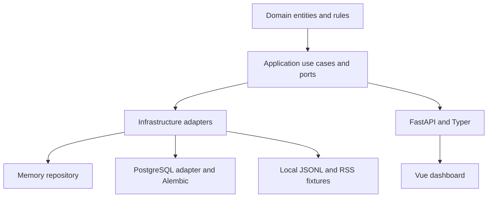
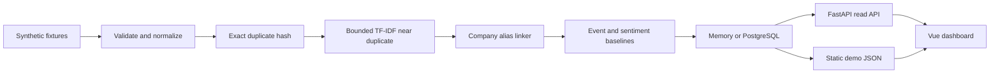

# Architecture

Milestone 0 is a modular monolith with ports and adapters.

## Boundaries

- `domain` is framework-independent.
- `application` owns use cases and ports.
- `infrastructure` implements adapters.
- `interfaces` exposes HTTP and CLI entrypoints.

No microservices, paid APIs, telemetry, model downloads, or full-text article storage are used in Milestone 0.

The audited memory-profile vertical slice processes 68 raw observations into 46 canonical articles, 18 duplicate observations, 7 daily digests, and 46 daily company signals. PostgreSQL is represented by SQLAlchemy models and Alembic migration, but runtime integration is not verified without Docker.
