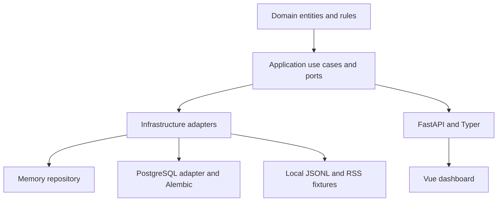
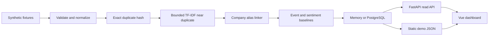
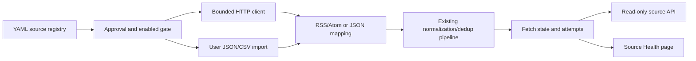
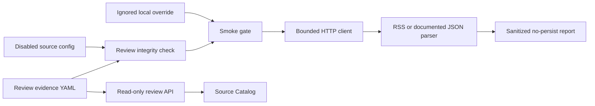

# Architecture

Milestone 0 is a modular monolith with ports and adapters.

## Boundaries

- `domain` is framework-independent.
- `application` owns use cases and ports.
- `infrastructure` implements adapters.
- `interfaces` exposes HTTP and CLI entrypoints.

No microservices, paid APIs, telemetry, model downloads, or full-text article storage are used in Milestone 0.

The audited memory-profile vertical slice processes 68 raw observations into 46 canonical articles, 18 duplicate observations, 7 daily digests, and 46 daily company signals. PostgreSQL integration is verified through disposable Docker.

## Milestone 1A Source Ingestion

The source layer is run-once and local-first. It introduces no scheduler, queue,
Redis, Kafka, search service, browser automation, or full-body cache.

## Milestone 1B Source Review And Smoke Testing

Milestone 1B keeps approval evidence repository-owned and runtime enablement
local-only. The smoke path is explicit CLI-only, no-persist by default, and does
not introduce API mutation routes, schedulers, or browser-side live requests.
