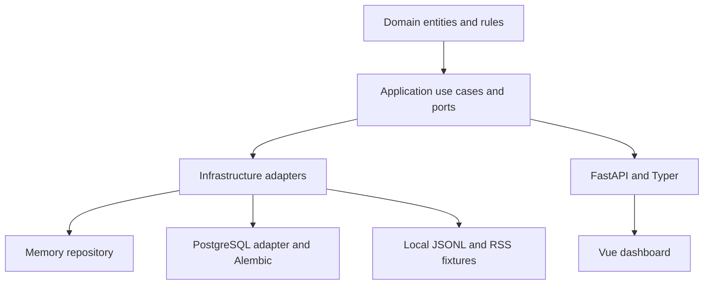
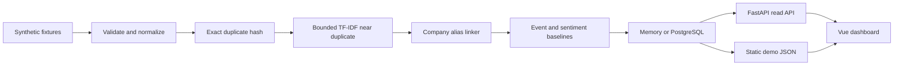
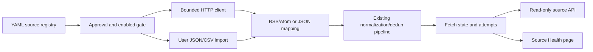
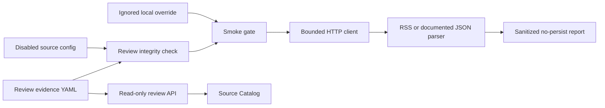
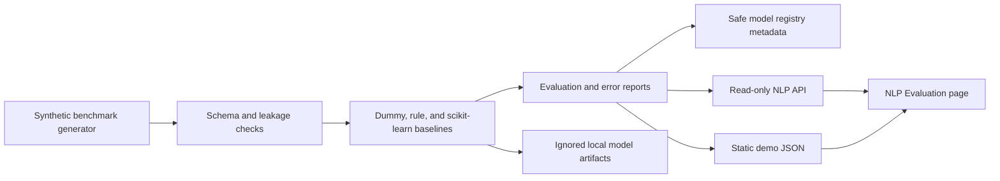
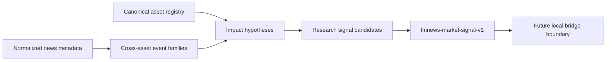
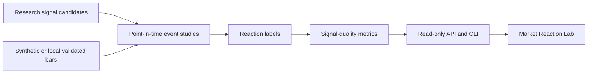

# Architecture

Milestone 0 is a modular monolith with ports and adapters.

Milestone 3A adds a research-export application service that reads existing news metadata through repository ports and writes deterministic packages plus safe metadata. FinNews owns news provenance, information availability, event/sentiment metadata, feature lineage, and the export contract. The future `ashare-research-platform` owns prices, returns, backtests, and portfolio logic.

Revised Milestone 3A makes cross-asset information intelligence the primary architecture path. The A-share research export remains an optional downstream adapter.

## Boundaries

- `domain` is framework-independent.
- `application` owns use cases and ports.
- `infrastructure` implements adapters.
- `interfaces` exposes HTTP and CLI entrypoints.

No microservices, paid APIs, telemetry, model downloads, or full-text article storage are used in Milestone 0.

The audited memory-profile vertical slice processes 68 raw observations into 46 canonical articles, 18 duplicate observations, 7 daily digests, and 46 daily company signals. PostgreSQL integration is verified through disposable Docker.

## Milestone 1A Source Ingestion

The source layer is run-once and local-first. It introduces no scheduler, queue,
Redis, Kafka, search service, browser automation, or full-body cache.

## Milestone 1B Source Review And Smoke Testing

Milestone 1B keeps approval evidence repository-owned and runtime enablement
local-only. The smoke path is explicit CLI-only, no-persist by default, and does
not introduce API mutation routes, schedulers, or browser-side live requests.

## Milestone 2A NLP Evaluation Lab

Model binaries stay under ignored `.finnews-artifacts/`. The committed
benchmark and reports contain only original synthetic records and safe metadata.
The default news pipeline remains rule-based; Milestone 2A adds evaluation
tooling rather than production model activation.

## Revised Milestone 3A Cross-Asset Foundation

The cross-asset layer adds domain entities for assets, aliases, provider symbols,
local broker-symbol mappings, relationships, events, impact hypotheses, signal
candidates, and publication runs. It keeps the dependency direction unchanged:
domain remains framework-free, application owns deterministic builders and
validators, infrastructure persists memory/PostgreSQL state, and interfaces
expose read-only API/CLI surfaces.

The MT5 boundary is documentation, validation, and readiness metadata only. The
repository contains no terminal adapter, no credentials, no account access, and
no execution path.

## Milestone 3C Market-Reaction Validation

M3C adds an application service for `finnews-market-bars-v1`, synthetic market
scenarios, event-study windows, reaction labels, signal-quality metrics, and
leakage diagnostics. Static demo output contains bounded samples for bars while
the API can generate the full deterministic in-memory synthetic bar set. The
new PostgreSQL migration stores metadata, revisions, labels, and metrics; it
does not store raw user files, credentials, account identifiers, or local import
paths.
